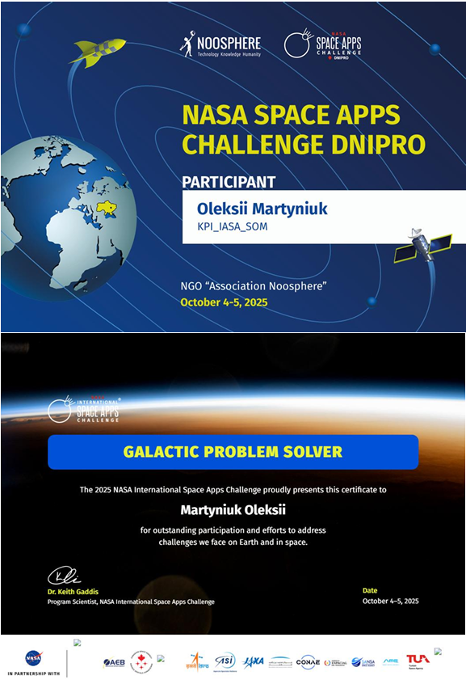
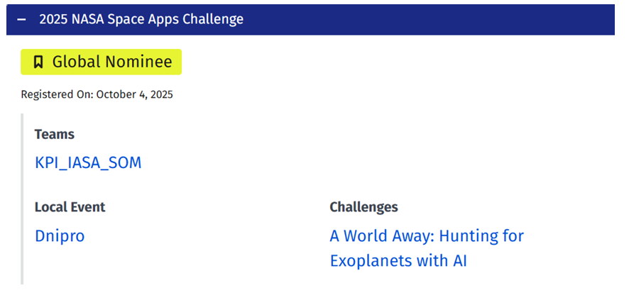

# NASA Exoplanet Classifier

**AI-powered exoplanet classification system built for the NASA Space Apps Challenge 2025**

Challenge: *"A World Away: Hunting for Exoplanets with AI"*

| | |
|---|---|
| **Live Demo** | [martyniukaleksei.github.io/nasa-exoplanet-classifier](https://martyniukaleksei.github.io/nasa-exoplanet-classifier) |
| **API** | [nasa-exoplanet-api.onrender.com](https://nasa-exoplanet-api.onrender.com) |
| **Team** | KPI_IASA_SOM — Igor Sikorsky Kyiv Polytechnic Institute, IASA Faculty |

---

## 1. Problem & Solution

### The Problem

Space missions such as Kepler and TESS have cataloged hundreds of thousands of transit signals from potential exoplanet candidates. Each signal must be vetted to distinguish genuine planetary transits from false positives — eclipsing binary stars, instrumental artifacts, and background contamination. Manual classification by domain experts is time-consuming and does not scale to the ever-growing volume of candidate detections.

### Our Solution

We developed an end-to-end machine learning pipeline that takes raw transit photometry parameters as input, engineers 25 physics-based features grounded in orbital mechanics and stellar astrophysics, and classifies each candidate into one of three categories using a 6-model ensemble with built-in uncertainty quantification. The system is deployed as a responsive web application with interactive 3D planet visualization, making exoplanet classification accessible to researchers and educators alike.

---

## 2. Data & Characteristics

### Data Source

All observational data is sourced from the **NASA Exoplanet Archive** via its TAP (Table Access Protocol) service, querying the Planetary Systems (`ps`) table using ADQL. Only confirmed transiting exoplanets with complete transit parameters are selected (`default_flag = 1`).

### Retrieved Fields

| Archive Column | Description | Units |
|---|---|---|
| `pl_orbper` | Orbital period | days |
| `pl_trandur` | Transit duration | hours |
| `pl_trandep` | Transit depth | fractional |
| `pl_ratror` | Planet-to-star radius ratio | — |
| `pl_rade` | Planet radius | Earth radii |
| `pl_orbsmax` | Semi-major axis | AU |
| `pl_eqt` | Equilibrium temperature | K |
| `pl_imppar` | Impact parameter | 0–1 |
| `st_mass` | Stellar mass | M☉ |
| `st_teff` | Stellar effective temperature | K |
| `st_optmag` | Stellar optical magnitude | mag |
| `sy_snum` | Number of stars in system | — |
| `sy_pnum` | Number of planets in system | — |

### Training Dataset Composition

| Class | Samples | Description |
|---|---|---|
| Confirmed Exoplanet | 1 000 | Verified transit detections with diverse period coverage |
| False Positive | 300 | Simulated eclipsing binaries with deep transits (5–50%) |
| Planetary Candidate | 200 | Lower-SNR detections reflecting observational uncertainty |

**Key characteristics:**
- Signal-to-Noise Ratio (SNR) is synthetically estimated from transit depth, stellar magnitude, and orbital period, as it is not directly available in the archive.
- The critical distinguishing feature between classes is transit depth: genuine exoplanets produce shallow dips (0.01–5%), while eclipsing binaries exhibit much deeper signals (5–50%).
- Confirmed exoplanets span four period regimes — ultra-short (<3 days), short (3–15 days), medium (20–100 days), and long (100–500 days) — ensuring the model generalizes across the full range of orbital configurations.

---

## 3. Model Architecture

### Preprocessing Pipeline

| Step | Method | Purpose |
|---|---|---|
| 1. Artifact detection | Physical validity checks | Remove non-physical parameter combinations |
| 2. Imputation | Median (`SimpleImputer`) | Handle missing values without introducing extremes |
| 3. Log transformation | `log1p` on orbital period, transit duration, transit depth | Stabilize log-normal distributions common in exoplanet data |
| 4. Outlier removal | Modified Z-score (MAD method, threshold 4.0) | Remove statistical outliers while preserving rare but valid detections |
| 5. Scaling | `RobustScaler` (IQR-based) | Normalize features with resistance to remaining outliers |
| 6. Quality scoring | SNR + transit depth consistency check | Weight observations by detection reliability |

### Feature Engineering

25 physics-based features are derived from 7 input parameters, organized in five categories:

**Transit Features** — duration-to-period ratio, planet-star radius ratio (from transit depth via √depth), estimated impact parameter, transit shape metric, signal strength

**Stellar Features** — density proxy, luminosity via the mass-luminosity relation (L ∝ M^3.5), brightness from magnitude, radius estimate from mass and temperature

**Orbital Mechanics** — semi-major axis via Kepler's Third Law (a ∝ P^{2/3} · M^{1/3}), orbital velocity proxy, insolation flux (inverse-square law), equilibrium temperature estimate

**Detection Reliability** — Multiple Event Statistic (MES) proxy, geometric transit probability (R_star / a), depth-noise ratio, transit duration anomaly relative to expected value

**Statistical Interactions** — period–SNR coupling, depth–duration interaction, stellar–planet size coupling, SNR efficiency per unit depth, period-normalized duration

### Classification Ensemble

Six classifiers are combined via **soft voting** (probability averaging):

| Model | Key Hyperparameters | Role in Ensemble |
|---|---|---|
| Random Forest | 200 trees, max_depth=15, balanced classes | Captures feature interactions |
| Gradient Boosting | 150 estimators, lr=0.05, max_depth=7 | Sequential error correction |
| Neural Network (MLP) | 128→64→32, ReLU, Adam, early stopping | Complex nonlinear patterns |
| Logistic Regression | C=1.0, balanced classes | Linear baseline |
| XGBoost | 200 estimators, lr=0.05, max_depth=8 | Regularized gradient boosting |
| LightGBM | 200 estimators, lr=0.05, max_depth=8 | Efficient gradient boosting |

**Output:** 3-class classification — *confirmed exoplanet*, *planetary candidate*, or *false positive* — with calibrated probability estimates.

**Uncertainty quantification:** Prediction entropy (normalized by max entropy log(3)) combined with inter-model agreement ratio. High uncertainty flags cases that may require expert review.

**Confirmation scoring:** A physics-based scoring system (0–100) evaluates each prediction against domain knowledge (SNR thresholds, transit depth ranges, stellar parameter consistency, long-period detection difficulty) and adjusts raw ensemble probabilities when warranted.

### Property Regression

Four separate ensemble regressors (Random Forest + Gradient Boosting + XGBoost) predict physical properties for confirmed and candidate detections:

- **Planet radius** (Earth radii)
- **Equilibrium temperature** (K)
- **Semi-major axis** (AU)
- **Impact parameter** (0–1)

Each prediction includes an uncertainty estimate derived from the standard deviation across the regressor ensemble.

### Pipeline Flow

```
Input (7 transit & stellar parameters)
    │
    ▼
Feature Engineering (25 physics-based features)
    │
    ├──▶ 6-Model Classification Ensemble ──▶ Class + Confidence + Uncertainty
    │         │
    │         ▼
    │    Confirmation Score (physics-based probability adjustment)
    │
    └──▶ 3-Regressor Property Ensemble ──▶ Planet Radius, Temperature, Orbit, Impact
```

### Validation

- **Classification:** 5-fold Stratified Cross-Validation for accuracy, Expected Calibration Error (ECE) for probability reliability, uncertainty–error correlation analysis
- **Regression:** MAE, RMSE, MAPE, and R² per predicted property

---

## 4. Full Solution Implementation

### System Architecture

```
┌──────────────┐       HTTPS        ┌──────────────────┐      REST API      ┌─────────────────┐
│              │  ◄───────────────►  │                  │  ◄──────────────►  │                 │
│  User        │                    │  GitHub Pages     │                    │  Render         │
│  Browser     │                    │  (Vanilla JS +    │                    │  (Flask + ML    │
│              │                    │   HTML5 Canvas)   │                    │   Models)       │
└──────────────┘                    └──────────────────┘                    └─────────────────┘
```

### Backend

- **Framework:** Python / Flask with Flask-CORS
- **Server:** Gunicorn (single worker, 120s timeout for ML inference)
- **Models:** Pre-trained scikit-learn, XGBoost, and LightGBM models serialized as `.pkl` files, loaded at startup
- **Endpoints:**

| Endpoint | Method | Description |
|---|---|---|
| `/predict` | POST | Single candidate classification |
| `/predict/batch` | POST | Batch classification |
| `/analyze` | POST | Classification with CORS preflight support |
| `/health` | GET | API health check |

### Frontend

- **Technology:** Vanilla JavaScript, HTML5, CSS3 — no framework dependencies
- **Input form:** 9 observational parameters with real-time validation and tooltip guidance
- **3D visualization:** HTML5 Canvas rendering of the classified exoplanet alongside Earth for scale comparison, with temperature-dependent surface coloring (deep blue for cold worlds through dark red for ultra-hot planets)
- **Resilience:** Fallback data generation when the API is unavailable
- **Design:** NASA-themed color palette with responsive layout

### Deployment

- **Backend:** Render (free tier) via Procfile
- **Frontend:** GitHub Pages served from the `/docs` directory

---

## 5. Results & Achievements

This project was awarded **1st place at the All-Ukrainian national stage** of the NASA Space Apps Challenge 2025 and advanced to **Global Nominee** status at the international stage of the competition.

<p align="center">
  
  &nbsp;&nbsp;&nbsp;
  
</p>
<p align="center">
  <em>Left: Galactic Problem Solver certificate — NASA Space Apps Challenge Dnipro, October 4–6, 2025</em><br/>
  <em>Right: Global Nominee — NASA Space Apps Challenge 2025, International Stage</em>
</p>

---

## Getting Started

**Backend:**
```bash
cd backend
pip install -r requirements.txt
python app.py
```

**Frontend:**
```bash
cd docs
npm install
npm run dev
```

---

*Developed by Team KPI_IASA_SOM for the NASA Space Apps Challenge 2025*
